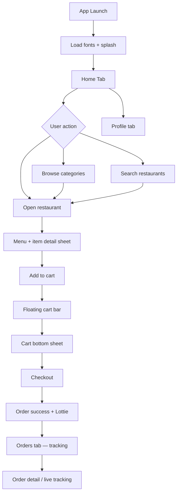

# foodRush — Application Flow Plan

Premium food delivery demo for client presentations. All data is local JSON; network is simulated with delays.

## User journeys



## Navigation architecture

| Layer | Route | Purpose |
|---|---|---|
| Root Stack | `(tabs)/*` | Main tab shell |
| Root Stack | `restaurant/[id]` | Restaurant menu (push, shared hero) |
| Root Stack | `checkout` | Delivery + payment demo |
| Root Stack | `order-success` | Confirmation modal |
| Root Stack | `order/[id]` | Live tracking |
| Tabs | `index` | Home — promos, categories, nearby |
| Tabs | `search` | Animated search + filters |
| Tabs | `orders` | History + active orders |
| Tabs | `profile` | Demo profile + settings |

Global overlays (root layout):

- **Floating cart bar** — visible when cart has items
- **Cart bottom sheet** — animated sheet from floating bar or restaurant

## Screen specifications

### Home

- Hero greeting + delivery address (glass pill)
- Promo carousel (auto-scroll, gradient cards)
- Category chips (horizontal)
- “Near you” restaurant list with skeleton → data
- Pull-to-refresh (simulated reload)
- Empty / error states with retry

### Search

- Focused search bar with scale animation
- Recent searches (local)
- Filter chips: rating, time, free delivery
- Results grid with shimmer loading
- Empty state when no matches

### Restaurant detail

- Parallax hero image + glass header on scroll
- Info row: rating, time, fee
- Menu sections (sticky section headers)
- Item cards with “+” add micro-interaction (scale + haptic)
- Item detail bottom sheet (customizations demo)

### Cart & checkout

- Cart sheet: line items, quantity stepper, subtotal
- Checkout: address, delivery time, tip, pay CTA
- Simulated payment delay → success

### Orders

- Active order card with animated progress
- Past orders list
- Tap → tracking screen with step timeline + map placeholder

### Profile

- Avatar, stats, demo settings rows
- Premium glass sections

## State management

| Store | File | Holds |
|---|---|---|
| Cart | `cart.store.ts` | Items, quantities, restaurant lock |
| Orders | `orders.store.ts` | Placed orders, active ID |
| App | `app.store.ts` | Address address, recent searches |

## Data layer

```
src/features/catalog/
  mocks/          categories.json, restaurants.json, promos.json
  types/          catalog.types.ts
  api/            catalog.api.ts   (simulateRequest + filters)
  hooks/          use-catalog.ts, use-restaurant.ts
```

## Animation inventory

| Interaction | Implementation |
|---|---|
| Screen push | Expo Router stack + Reanimated entering |
| Shared hero | Matched `restaurant/[id]` header image |
| Skeleton | Shimmer gradient loop (Reanimated) |
| Add to cart | Scale bounce + cart badge pop |
| Floating cart | Slide up + pulse on add |
| Cart sheet | Spring translateY + backdrop blur |
| Pull-to-refresh | Native RefreshControl |
| Search focus | Scale + shadow on input container |
| Order success | Lottie + fade scale |
| Haptics | `expo-haptics` on add, checkout, success |

## Design tokens

See `src/theme/` — luxury cream palette, 20–28px radii, glass cards, soft boxShadow, DM Sans + Playfair Display.

## Demo limitations (intentional)

- No real auth, payments, or maps SDK
- Images load from bundled URLs (network required for photos)
- Single delivery address preset
- One active order simulation on tracking screen
